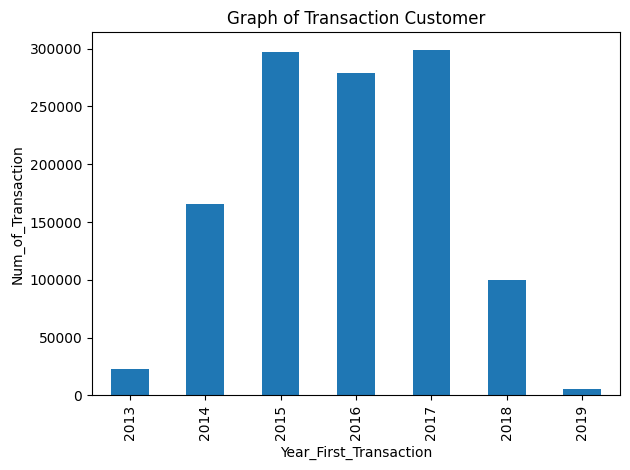

# Customer Churn Prediction using Machine Learning

Dataset yang digunakan pada project ini merupakan dataset **DQLab sport center**

## Data Preparation
Langkah-langkah yang dilakukan yaitu:
* Mengubah format kolom First_Transaction dan Last_Transaction menjadi datetime(YYYY-MM-DD)
* Mengklasifikasikan customer kedalam status churn atau tidak
* Menghapus kolom yang tidak diperlukan(no dan Row_Num)

## Exploratory Data Analysis
### Customer Acquisition

Berdasarkan bar chart yang telah dibuat terlihat bahwa customer baru paling banyak diperoleh pada tahun 2017

### Total Transaction

Berdasarkan bar chart tersebut terlihat bahwa transaksi paling banyak terjadi pada tahun 2015 dan 2017

### Average Transaction Amount

Berdasarkan plot yang telah dibuat terlihat bahwa:
* Sejak tahun 2015-2019 transaksi rata-rata jaket terus mengalami peningkatan
* Sejak tahun 2017-2019 rata-rata sepatu terus mengalami penurunan

### Churn Proportion

Berdasarkan pie chart tersebut terlihat bahwa jaket merupakan produk dengan presentase churn terbanyak yaitu 68%

### Customer Distribution
#### Distribusi customer berdasarkan Count_Transaction

Berdasarkan bar chart yang telah dibuat terlihat bahwa customer paling banyak melakukan transaksi dalam rentang 0 s/d 1 yang dikelompokan dalam group 1

#### Distribusi customer berdasarkan Average_Transaction_Amount

Berdasarkan bar chart yang telah dibuat terlihat bahwa rata-rata total transaksi yang dilakukan oleh customer sebesar >1.000.000 - 2.500.000 yang dikelompokan dalam group 5

# Data Preprocessing
* Menentukan kolom feature (X) dan target (y)

